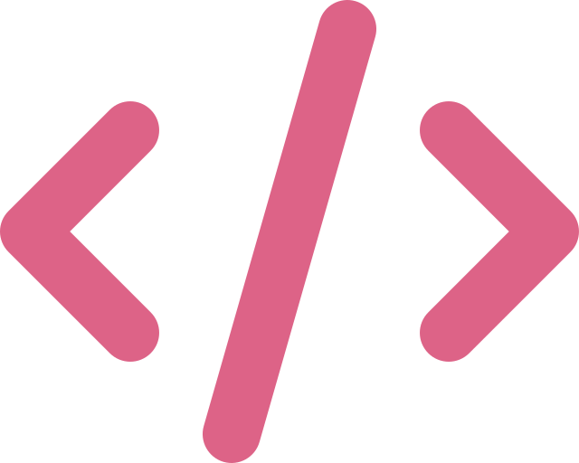
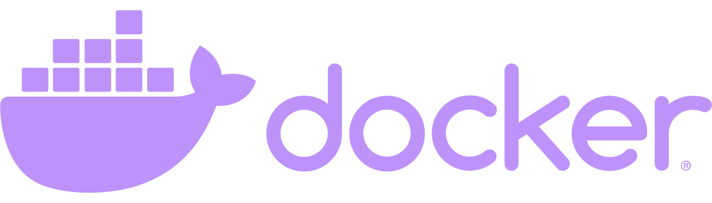

    

##  About me

- ###  I am student of Bauman Moscow State University.
- ###  Into backend development.

##  Languages and Tools
<code></code>
<code></code>
<code></code>
<code></code>
<code></code>
<code></code>
<code></code>
<code></code>
<code></code>

##  Contact me

##  Statistics

